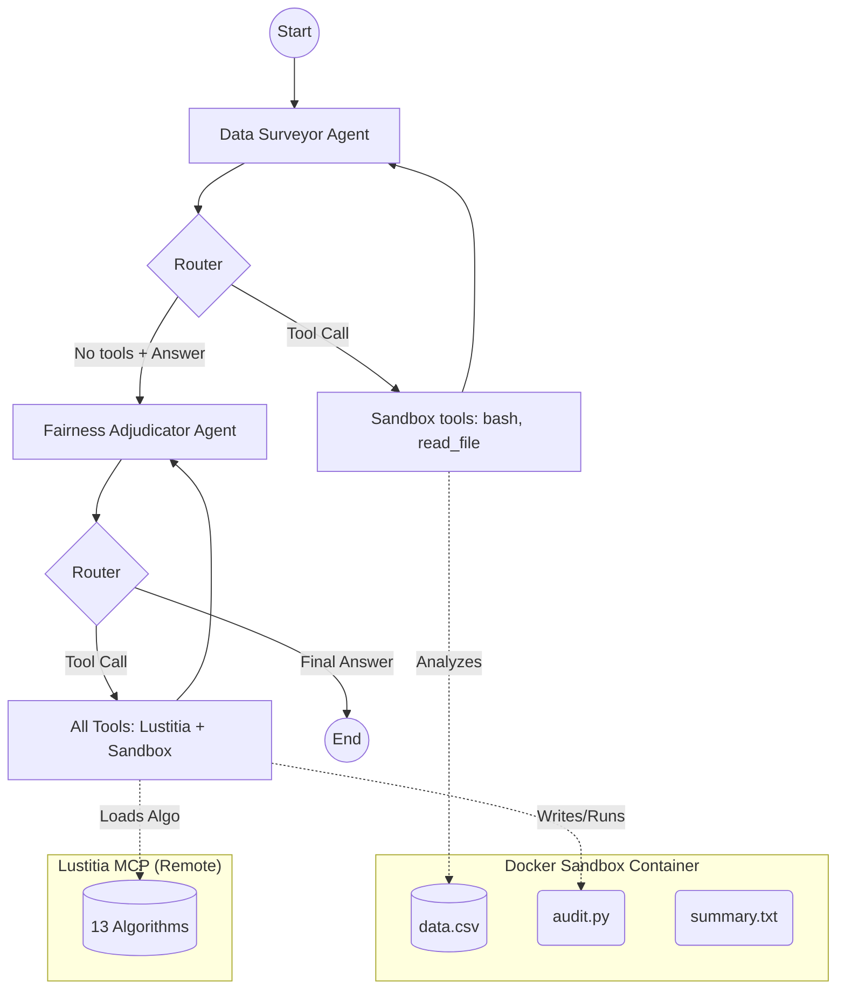

# Lustitia: Fairness Auditing Agent

## 🚀 Quick Start (Fresh Setup)

Follow these steps to get the full automated multi-agent pipeline running:

1. **Install Dependencies**:
   ```bash
   pip install -r requirements.txt
   ```

2. **Build the Sandbox**:
   ```bash
   # Compiles the clean data-science environment for the agent to use
   docker build -t sandbox-python:latest ./mcps/sandbox
   ```

3. **Configure Secrets**:
   - Place your Google Cloud Vertex AI service account JSON file at:
     `.secrets/vertex-credentials.json`

4. **Add Data**:
   - Place your target dataset at:
     `dataset/data.csv`

5. **Run the Audit**:
   ```bash
   python main.py
   ```

## Overview

**Lustitia** is a production-ready Model Context Protocol (MCP) server that delivers algorithmic fairness auditing capabilities directly to LLM agents. Instead of exposing rigid API endpoints, the server uses a **Knowledge Skill Delivery Model** -- providing runnable pseudo-code, mathematical specifications, parameter tuning guides, and causal constraints dynamically to any MCP-compatible agent (Claude Desktop, Cursor, LM Studio, or any MCP client).

This allows agents to compile, execute, and sandbox fairness models aligned with user datasets without relying on external web services or pre-built libraries.

## Architecture

```
.
├── .secrets/             # Secure credentials (Vertex AI JSON)
├── agents/               # LangGraph Orchestration
│   ├── prompts/          # Externalized Markdown prompts
│   └── graph.py          # Dual-MCP state machine logic
├── dataset/              # Source data (data.csv)
├── mcps/                 # Unified MCP Servers
│   ├── auditor/          # Lustitia Algorithm Knowledge Delivery
│   └── sandbox/          # Dockerized Python Execution Environment
├── outputs/              # Host-synced bias graphs and summaries
├── main.py               # Unified entry point
├── Procfile              # Railway deployment config
└── requirements.txt      # Python dependencies
```

### Agent Workflow Diagram



### Agent Roles

| Agent | Purpose | Tools Used |
|-------|---------|------------|
| **Data Surveyor** | Profiles raw data, verifies column types, and checks for missing values or correlations. | Sandbox `bash`, `read_file` |
| **Fairness Adjudicator** | Selects the best bias-audit algorithm, writes implementation code, and executes the audit inside the sandbox. | Lustitia `auditor`, Sandbox `bash` |

### Dual-Knowledge Delivery Model

The server differentiates between two algorithm delivery types:

| Type | Delivery Format | When Used |
|------|----------------|-----------|
| **PURE** | Single `knowledge.md` file with complete pseudo-code, formulas, and implementation instructions | Algorithms with straightforward mathematical paths (e.g., threshold optimization, BER certification) |
| **FRAMEWORK** | Multi-step `framework.yaml` DAG + `framework_scaffold.py` state machine | Complex pipelines requiring sequential execution with dependencies (e.g., generational tracking, convex optimization) |

### Server Components

```
mcps/auditor/
  server.py               # FastMCP server with tool registry
  framework_scaffold.py   # State-machine executor for FRAMEWORK DAGs
  algo1/knowledge.md      # PURE: Disparate Impact (80% Rule)
  ...
mcps/sandbox/
  Dockerfile              # Clean environment with statsmodels/scipy
  mcp_server.py           # SSE-based Sandbox interface
```

### MCP Tools Exposed

| Tool | Purpose |
|------|---------|
| `list_algorithms()` | Returns a JSON menu of all 13 registered algorithms with IDs and names |
| `get_algorithm_info(algorithm_id)` | Returns full metadata: name, type, purpose, sector suitability, and tool schemas. Pass `"all"` for the complete registry |
| `load_algorithm_knowledge(algorithm_id)` | Loads the algorithm's knowledge skill (markdown or YAML+scaffold) directly into the agent's context window |

## Implemented Algorithms

### PURE Algorithms (6)

| ID | Name | Detection | Mitigation | Key Technique |
|----|------|-----------|------------|---------------|
| `algo1` | Disparate Impact (80% Rule) | BER certification against epsilon threshold | Geometric repair via quantile-aligned CDF transformation | Balanced Error Rate, Empirical CDF |
| `algo2` | Equality of Opportunity | TPR/FPR parity measurement across groups | Group-specific threshold optimization via grid search | Equalized Odds, loss-weighted threshold |
| `algo3` | Recidivism Fairness | Impossibility theorem validation (Eq. 2.6) | Explicit tradeoff calibration (FPR/FNR/PPV strategies) | Base rate divergence, penalty disparity |
| `algo6` | Brownian Distance Covariance | Non-linear proxy detection via dCor with permutation FDR | Non-linear residualization (GBR regression) | Double-centered distance matrices, BH correction |
| `algo9` | Causal Fair Inference (PSE) | Path-Specific Effect estimation via IPW with bootstrap CI | Constrained Maximum Likelihood (SLSQP with PSE bounds) | Inverse Probability Weighting, NDE |
| `algo11` | Causal Explanation Formula | Mechanism decomposition: TV = SE + IE - DE | Narrow Tailoring optimization with legal feasibility bounds | Counterfactual direct/indirect/spurious effects |

### FRAMEWORK Algorithms (7)

| ID | Name | Pipeline Steps | Key Technique |
|----|------|---------------|---------------|
| `algo4` | Intersectional Subgroup Scan | 4 steps: Combinatorial generation, DIR + chi-squared, BH FDR, Ranking | Intersectional group fairness, multiple testing correction |
| `algo5` | Mutual Information Proxy Scanner | 4 steps: KSG MI estimation, Null permutations, FDR correction, Residualization | Information-theoretic dependence, Ridge residuals |
| `algo7` | SHAP Feature Attribution Auditing | 4 steps: Baseline, KernelSHAP, Proxy scoring, Mitigation (reweight/residualize/remove) | Game-theoretic attribution, exponential sample reweighting |
| `algo10` | Counterfactual Fairness (OB) | 3 steps: Correlation audit, SVD orthogonal projection, Matrix reconstruction | Lagrange orthogonalization, SVD decomposition |
| `algo12` | Fairness Feedback Loops (MIDS + STAR) | 6 steps: DP, EOdds, AccGap, KL-divergence, Generational tracking, STAR batch sampling | Model-Induced Distribution Shifts, quota-based reparation |
| `algo13` | DRO Fairness Without Demographics | 5 steps: Group risks, Disparity dynamics, Spectral radius, DRO params, Dual SGD training | Chi-squared DRO, Jacobian stability analysis |
| `algo14` | Relational Fairness (FairPSL) | 4 steps: FOL grounding, RD/RR/RC metrics, Linear constraints, Convex MAP inference | First-Order Logic, Probabilistic Soft Logic, CVXPY |

## Sector Suitability Matrix

| Algorithm | Hiring | Finance | Healthcare | Criminal Justice | Education |
|-----------|--------|---------|------------|-----------------|-----------|
| algo1 | Yes | Yes | -- | Yes | -- |
| algo2 | Yes | Yes | -- | Yes | -- |
| algo3 | -- | -- | -- | Yes | -- |
| algo4 | Yes | Yes | Yes | Yes | Yes |
| algo5 | Yes | Yes | Yes | -- | Yes |
| algo6 | Yes | Yes | Yes | -- | Yes |
| algo7 | Yes | Yes | Yes | -- | Yes |
| algo9 | Yes | Yes | -- | -- | Yes |
| algo10 | Yes | Yes | -- | -- | Yes |
| algo11 | Yes | Yes | -- | -- | Yes |
| algo12 | Yes | Yes | -- | -- | Yes |
| algo13 | -- | Yes | Yes | -- | Yes |
| algo14 | Yes | Yes | -- | -- | Yes |

## Installation

### Dependencies

```bash
pip install mcp numpy pandas scipy scikit-learn statsmodels shap
```

For FRAMEWORK algorithms requiring deep learning (algo12, algo13):

```bash
pip install torch
```

For FRAMEWORK algorithms requiring convex optimization (algo14):

```bash
pip install cvxpy
```

### Claude Desktop Integration

Add to `claude_desktop_config.json` (located in `%APPDATA%\Claude`):

```json
{
  "mcpServers": {
    "lustitia-auditor": {
      "command": "python",
      "args": ["C:\\path\\to\\your\\mcps\\auditor\\server.py"]
    },
    "lustitia-sandbox": {
      "command": "python",
      "args": ["C:\\path\\to\\your\\mcps\\sandbox\\mcp_server.py"]
    }
  }
}
```

### Cursor / Generic MCP Client

Add to your MCP configuration file:

```json
{
  "mcpServers": {
    "lustitia-auditor": {
      "command": "python",
      "args": ["C:\\path\\to\\your\\mcps\\auditor\\server.py"]
    }
  }
}
```

## Agent Workflow

When an LLM agent connects to this server, the recommended operational sequence is:

1. **Discovery**: Call `list_algorithms()` to see the full menu of available algorithms.
2. **Selection**: Call `get_algorithm_info(algorithm_id)` to read metadata, purpose, and sector suitability for the target algorithm.
3. **Loading**: Call `load_algorithm_knowledge(algorithm_id)` to inject the full implementation knowledge into context.
4. **Implementation**:
   - If **PURE**: Write the detection and mitigation functions directly from the pseudo-code in `knowledge.md`.
   - If **FRAMEWORK**: Follow the DAG steps sequentially, using the `framework_scaffold.py` state machine or implementing the pipeline manually from the YAML specification.
5. **Execution**: Run the implementation against the user's dataset, using the `agent_parameter_tuning_guide` to select appropriate parameter values based on dataset characteristics.

## Knowledge Skill Quality Standards

Every algorithm knowledge file adheres to these standards:

- **Runnable Python pseudo-code** with imports, edge-case handling, and type annotations
- **Full docstrings** with Args and Returns on every function
- **Default parameter values** with dataset-conditional tuning guidance
- **Explicit output specifications** (exact dictionary keys and types returned)
- **Actionable bug warnings** (division-by-zero guards, memory limits, convergence checks)
- **No filler text** -- every line serves a functional purpose for agent implementation

## Research Papers

The `PAPER/` directory contains the original research papers and analysis for each algorithm, including detailed mathematical derivations, bias type analysis, and sector suitability assessments.

## License

This project is provided for academic and research purposes.
