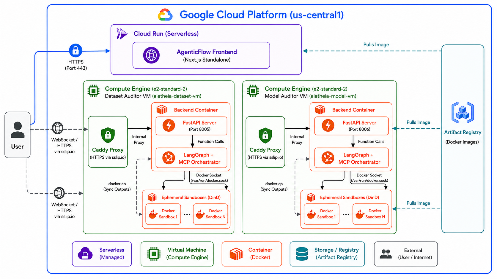

<div align="center">

# ALETHEIA AI

### Production-Grade Algorithmic Fairness Auditing via Multi-Agent AI

[](LICENSE)
[](https://python.org)
[](https://fastapi.tiangolo.com)
[](https://nextjs.org)
[](https://docker.com)
[](https://cloud.google.com)
[](https://modelcontextprotocol.io)
[](https://langchain-ai.github.io/langgraph)

**[Live Demo](https://aletheia-frontend-69262873588.us-central1.run.app/)**

---

*Most AI fairness tools tell you a number. Aletheia tells you who is being harmed, why, how to fix it, and proves it worked — automatically, end to end, in plain English.*

---

</div>

---

## The Problem

Algorithmic bias is one of the most consequential unsolved problems in applied AI. Criminal justice systems flag innocent people as high-risk at twice the rate for certain racial groups. Hiring models reject qualified candidates based on zip code. Loan systems deny credit using proxies that encode the very discrimination they claim to avoid.

Most organisations know this is happening. Almost none have the tools to prove it, measure it precisely, fix it, and document the fix for regulators — without a dedicated team of ML fairness researchers.

**Aletheia solves this end to end.** Upload a CSV. Get a legally-referenced, plain-English audit report with before/after comparisons, compliance status, and a fixed dataset — fully automated, in minutes.

---

## What Makes This Hard (And Why Existing Tools Fall Short)

| Limitation | Existing Tools | Aletheia |
|---|---|---|
| Requires ML expertise to interpret | Yes | No — plain English throughout |
| Detects only surface-level bias | Yes | Detects proxy, intersectional, causal, and indirect bias |
| Static algorithm selection | Yes | Dynamic selection from 13 algorithms per dataset |
| No mitigation | Most | Full mitigation with before/after proof |
| No compliance mapping | No | EEOC, EU AI Act, ISO 24027 |
| No PDF audit trail | No | Publication-ready PDF with charts |
| Requires code changes | Yes | Zero-code — drag, drop, run |

---

## Architecture Overview

Aletheia is a distributed multi-agent system built on three core layers:

```
├── agents/                     # LangGraph Multi-Agent Orchestration
│   ├── prompts/                # Externalized Markdown agent prompts
│   └── graph.py                # Dual-MCP state machine logic
├── backend/                    # FastAPI Server — WebSocket Streaming
│   └── api.py                  # Orchestrates agent graph, serves artifacts
├── frontend/                   # React/Next.js AgenticFlow Dashboard
│   └── agenticflow/            # Live observability, interactive nodes, deep-dive modal
├── mcps/                       # Unified Model Context Protocol Servers
│   ├── auditor/                # Aletheia Algorithm Knowledge Delivery (13 algorithms)
│   ├── sandbox/                # Dockerized Python Execution Environment
│   └── miscellaneous/          # UI Blueprint and Chart Schema Delivery
├── dataset/                    # Source data input (data.csv)
├── outputs/                    # Host-synced charts, JSON, code logs, PDF report
├── main.py                     # CLI entry point
├── Procfile                    # Railway deployment config
└── requirements.txt
```


### The Four-Agent Pipeline

Each agent is a specialised LLM instance with its own tools, prompt, and responsibility boundary. They communicate via a shared state graph orchestrated by LangGraph.

| Agent | Role | Tools |
|-------|------|-------|
| **Data Surveyor** | Exhaustive EDA — profiles every column, detects proxies, identifies protected attributes, flags data quality issues, selects chart types dynamically | `execute_cell`, `write_file`, `get_chart_schemas` |
| **Fairness Adjudicator** | Selects the optimal algorithm from 13 options, implements it exactly, computes FPR/TPR/DIR/SPD/EOD/FPRD per group, generates plain-English findings | `list_algorithms`, `load_algorithm_knowledge`, `execute_cell`, `get_chart_schemas` |
| **Bias Mitigator** | Applies group-specific calibration or residualization, computes before/after metrics, calculates fairness score improvement, saves fixed dataset | `load_algorithm_knowledge`, `execute_cell`, `write_file` |
| **Report Compiler** | Reads all three agent outputs, generates matplotlib/seaborn charts as PNGs, compiles a full multi-section PDF using ReportLab with tables, compliance status, and executive summary | `execute_cell`, `read_file`, `write_file` |

---

## The Knowledge Skill Delivery Model

The core technical innovation is the **Aletheia MCP Auditor** — a Model Context Protocol server that delivers algorithm knowledge dynamically to LLM agents rather than hardcoding implementations.

Instead of brittle API calls or pre-built library wrappers, the server injects complete runnable pseudo-code, mathematical specifications, parameter tuning guides, and causal constraints directly into the agent's context window at runtime. The agent then implements the algorithm from first principles inside a sandboxed Docker container.

This means:
- Any new algorithm can be added without touching agent code
- The agent adapts implementation to the specific dataset structure
- No dependency on external fairness libraries that may not fit the data
- Full auditability — the exact implementation is logged and reproducible

### Two Delivery Modes

| Type | Format | When Used |
|------|--------|-----------|
| **PURE** | Single `knowledge.md` — complete pseudo-code, formulas, parameter guides | Algorithms with direct mathematical paths: threshold optimisation, BER certification |
| **FRAMEWORK** | Multi-step `framework.yaml` DAG + `framework_scaffold.py` state machine | Complex sequential pipelines: generational tracking, convex optimisation, causal inference |

---

## The Algorithm Library — 13 Implemented Algorithms

### PURE Algorithms

| ID | Name | Detection Method | Mitigation Technique |
|----|------|-----------------|---------------------|
| `disparate_impact_repair` | Disparate Impact (80% Rule) | BER certification against epsilon threshold | Geometric repair via quantile-aligned CDF transformation |
| `equality_of_opportunity` | Equality of Opportunity | TPR/FPR parity measurement across groups | Group-specific threshold optimisation via grid search |
| `recidivism_fairness_calibration` | Recidivism Fairness Calibration | Impossibility theorem validation (Eq. 2.6) | Explicit tradeoff calibration — FPR/FNR/PPV strategies |
| `brownian_distance_covariance` | Brownian Distance Covariance | Non-linear proxy detection via dCor with permutation FDR | Non-linear residualization via gradient-boosted regression |
| `causal_fair_inference` | Causal Fair Inference (PSE) | Path-Specific Effect estimation via IPW with bootstrap CI | Constrained Maximum Likelihood with SLSQP and PSE bounds |
| `causal_explanation_formula` | Causal Explanation Formula | Mechanism decomposition: TV = SE + IE - DE | Narrow Tailoring optimisation with legal feasibility bounds |

### FRAMEWORK Algorithms

| ID | Name | Pipeline Steps | Core Technique |
|----|------|---------------|----------------|
| `intersectional_subgroup_scan` | Intersectional Subgroup Scan | 4: Combinatorial generation, DIR + chi-squared, BH FDR, Ranking | Intersectional group fairness, multiple testing correction |
| `mutual_info_proxy_scanner` | Mutual Information Proxy Scanner | 4: KSG MI estimation, Null permutations, FDR correction, Residualization | Information-theoretic dependence, Ridge residuals |
| `shap_proxy_detection` | SHAP Feature Attribution Auditing | 4: Baseline, KernelSHAP, Proxy scoring, Mitigation | Game-theoretic attribution, exponential sample reweighting |
| `counterfactual_orthogonalization` | Counterfactual Fairness (OB) | 3: Correlation audit, SVD orthogonal projection, Matrix reconstruction | Lagrange orthogonalization, SVD decomposition |
| `fairness_feedback_reparation` | Fairness Feedback Loops (MIDS + STAR) | 6: DP, EOdds, AccGap, KL-divergence, Generational tracking, STAR batch sampling | Model-Induced Distribution Shifts, quota-based reparation |
| `dro_fairness_no_demographics` | DRO Fairness Without Demographics | 5: Group risks, Disparity dynamics, Spectral radius, DRO params, Dual SGD | Chi-squared DRO, Jacobian stability analysis |
| `relational_fairness_psl` | Relational Fairness (FairPSL) | 4: FOL grounding, RD/RR/RC metrics, Linear constraints, Convex MAP inference | First-Order Logic, Probabilistic Soft Logic, CVXPY |

### Sector Suitability Matrix

| Algorithm | Hiring | Finance | Healthcare | Criminal Justice | Education |
|-----------|:------:|:-------:|:----------:|:----------------:|:---------:|
| `disparate_impact_repair` | Yes | Yes | -- | Yes | -- |
| `equality_of_opportunity` | Yes | Yes | -- | Yes | -- |
| `recidivism_fairness_calibration` | -- | -- | -- | Yes | -- |
| `intersectional_subgroup_scan` | Yes | Yes | Yes | Yes | Yes |
| `mutual_info_proxy_scanner` | Yes | Yes | Yes | -- | Yes |
| `brownian_distance_covariance` | Yes | Yes | Yes | -- | Yes |
| `shap_proxy_detection` | Yes | Yes | Yes | -- | Yes |
| `causal_fair_inference` | Yes | Yes | -- | -- | Yes |
| `counterfactual_orthogonalization` | Yes | Yes | -- | -- | Yes |
| `causal_explanation_formula` | Yes | Yes | -- | -- | Yes |
| `fairness_feedback_reparation` | Yes | Yes | -- | -- | Yes |
| `dro_fairness_no_demographics` | -- | Yes | Yes | -- | Yes |
| `relational_fairness_psl` | Yes | Yes | -- | -- | Yes |

---

## What Aletheia Produces

For every dataset, Aletheia automatically generates:

**For Non-Technical Decision Makers**
- Plain-English verdict: who is harmed, by how much, what the consequence is
- False alarm rate by group with colour-coded severity (red/yellow/green)
- Before vs after comparison showing exactly what improved
- Compliance status against EEOC 4/5ths rule, EU AI Act, ISO 24027
- Overall fairness score (0-100) before and after mitigation
- Recommended next steps in plain English
- Publication-ready PDF audit report with all charts and tables

**For ML and Data Teams**
- Full EDA report with column profiles, correlation analysis, proxy detection
- Exact fairness metrics: DIR, SPD, EOD, FPRD per protected group
- Chi-squared statistical tests with p-values
- Algorithm selection rationale and implementation log
- Fixed dataset CSV with mitigated predictions
- All intermediate agent reports (agent1.md through agent4.md)

**For Compliance and Legal**
- EEOC 4/5ths rule pass/fail before and after
- EU AI Act documentation compliance
- ISO 24027 bias taxonomy documentation
- Full reproducible audit trail across all four agents

---

## Security and Privacy

- All data processing runs inside an isolated Docker sandbox container — no data leaves the container during analysis
- No dataset content is stored, logged, or transmitted to external services
- The sandbox environment resets between runs — no cross-contamination between audits
- Vertex AI credentials are stored as secrets and never embedded in code or images
- The fixed dataset is written only to the local `/outputs/` directory under explicit user control
- Agent prompts are externalized to Markdown files — fully auditable and version-controlled

---

## Performance and Scalability

- The sandboxed `execute_cell` REPL is persistent within a run — variables stay in memory across cells, avoiding redundant I/O
- All chart generation uses matplotlib with `Agg` backend — no display server required, fully headless
- The FastAPI backend streams agent output via WebSocket — the UI updates in real time without polling
- The four-agent pipeline runs sequentially with shared state — each agent reads only the outputs it needs, minimising token usage
- Google Cloud deployment uses Cloud Run for the frontend (auto-scaling) and a dedicated VM for the backend and sandbox (persistent Docker socket)
- The PDF is compiled server-side using ReportLab — no browser rendering dependency, suitable for CLI-only deployment

---

## The AgenticFlow Dashboard

The frontend is a live forensic observability dashboard built in Next.js with real-time WebSocket streaming.

**Key interface features:**
- Drag-and-drop CSV upload with instant dataset preview
- Interactive agent node graph — click any agent to inspect its live output, charts, and code
- Deep-dive modal per agent showing Analytics, Review, and Code tabs
- Dynamic chart rendering from agent-generated JSON using the chart schema system
- Plain-English findings panel with colour-coded severity (error/warning/success)
- One-click download for PDF report, fixed CSV, and technical ZIP

The chart schema system (`get_chart_schemas` MCP tool) ensures the agent always generates JSON that matches exactly what the frontend can render — bar, grouped bar, stacked bar, line, scatter, box plot, heatmap, waterfall — with no hardcoded chart types.

---

## MCP Tools Reference

### Aletheia Auditor Tools

| Tool | Purpose |
|------|---------|
| `list_algorithms()` | Returns a JSON menu of all 13 registered algorithms with IDs and names |
| `get_algorithm_info(algorithm_id)` | Returns full metadata: name, type, purpose, sector suitability, tool schemas. Pass `"all"` for complete registry |
| `load_algorithm_knowledge(algorithm_id)` | Loads the algorithm knowledge skill (Markdown or YAML + scaffold) directly into the agent context window |

### Sandbox Execution Tools

| Tool | Purpose |
|------|---------|
| `bash(command)` | Executes shell commands inside the Docker sandbox |
| `execute_cell(code)` | Runs a Jupyter-style Python cell and streams output |
| `read_file(path)` | Reads a file from the sandbox container |
| `write_file(path, content)` | Writes a new file to the sandbox container |
| `edit_file(path, target, replacement)` | Surgically edits specific blocks within a file |
| `grep(pattern, path)` | Searches for text patterns within sandbox files |
| `list_files(path)` | Lists directory contents in the sandbox |
| `lint_code(path)` | Runs syntax checking on Python files before execution |

---

## Knowledge Skill Quality Standards

Every algorithm knowledge file in the library adheres to:

- Runnable Python pseudo-code with imports, edge-case handling, and type annotations
- Full docstrings with Args and Returns on every function
- Default parameter values with dataset-conditional tuning guidance
- Explicit output specifications — exact dictionary keys and types returned
- Actionable bug warnings — division-by-zero guards, memory limits, convergence checks
- No filler text — every line serves a functional purpose for agent implementation

---

## Quick Start

### CLI Pipeline

```bash
# 1. Install dependencies
pip install -r requirements.txt

# 2. Build the sandbox
docker build -t sandbox-python:latest ./mcps/sandbox

# 3. Configure credentials
# Place your Google Cloud Vertex AI service account JSON at:
# .secrets/vertex-credentials.json

# 4. Add your dataset
# Place your CSV at: dataset/data.csv

# 5. Run the full audit pipeline
python main.py
```

### AgenticFlow Web Dashboard

```bash
# Start the FastAPI backend (Port 8000-8002, artifacts on Port 8005)
python backend/api.py

# Start the frontend
cd frontend/agenticflow
npm install
npm run dev
# Open http://localhost:3000
```

---

## Google Cloud Deployment



Aletheia runs as a distributed production application on Google Cloud — Cloud Run for the auto-scaling frontend, a dedicated VM for the backend and Docker sandbox.

### Deploy Frontend

```bash
docker build -t us-central1-docker.pkg.dev/project-f97facc4-90fc-43df-91f/aletheia/frontend:latest \
  --build-arg NEXT_PUBLIC_API_URL=https://34-46-180-121.sslip.io \
  --build-arg NEXT_PUBLIC_WS_URL=wss://34-46-180-121.sslip.io \
  ./frontend/agenticflow

docker push us-central1-docker.pkg.dev/project-f97facc4-90fc-43df-91f/aletheia/frontend:latest

gcloud run deploy aletheia-frontend \
  --image us-central1-docker.pkg.dev/project-f97facc4-90fc-43df-91f/aletheia/frontend:latest \
  --region us-central1 \
  --project project-f97facc4-90fc-43df-91f
```

### Deploy Backend

```bash
docker build -t us-central1-docker.pkg.dev/project-f97facc4-90fc-43df-91f/aletheia/backend:latest \
  -f Dockerfile.backend .

docker push us-central1-docker.pkg.dev/project-f97facc4-90fc-43df-91f/aletheia/backend:latest

gcloud compute ssh aletheia-backend --zone=us-central1-a --command="\
  sudo docker pull us-central1-docker.pkg.dev/project-f97facc4-90fc-43df-91f/aletheia/backend:latest && \
  sudo docker rm -f aletheia-backend && \
  sudo docker run -d --name aletheia-backend --restart=always -p 8005:8005 \
  -v /var/run/docker.sock:/var/run/docker.sock \
  us-central1-docker.pkg.dev/project-f97facc4-90fc-43df-91f/aletheia/backend:latest"
```

### Useful VM Commands

```bash
# Stream backend logs
gcloud compute ssh aletheia-backend --zone=us-central1-a \
  --command="sudo docker logs aletheia-backend -f"

# Check running sandbox containers
gcloud compute ssh aletheia-backend --zone=us-central1-a \
  --command="sudo docker ps"
```

---

## Claude Desktop Integration

```json
{
  "mcpServers": {
    "aletheia-auditor": {
      "command": "python",
      "args": ["C:\\path\\to\\mcps\\auditor\\server.py"]
    },
    "aletheia-sandbox": {
      "command": "python",
      "args": ["C:\\path\\to\\mcps\\sandbox\\mcp_server.py"]
    }
  }
}
```

---

## Installation

### Core Dependencies

```bash
pip install mcp numpy pandas scipy scikit-learn statsmodels shap
```

### Deep Learning Algorithms

Required for `fairness_feedback_reparation` and `dro_fairness_no_demographics`:

```bash
pip install torch
```

### Convex Optimisation Algorithms

Required for `relational_fairness_psl`:

```bash
pip install cvxpy
```

---

## Research Foundation

The `PAPER/` directory contains original research papers and mathematical derivations for each algorithm, including bias type analysis, sector suitability assessments, and formal proofs of the fairness properties each algorithm guarantees and the trade-offs it accepts.

---

## Future Roadmap

- **Continuous monitoring** — scheduled re-audits as new data arrives, with drift detection alerting when fairness degrades
- **Multi-dataset comparison** — audit the same model across demographic subpopulations in different geographies
- **Regulatory report templates** — pre-formatted outputs aligned to EEOC, EU AI Act Article 10, and UK Equality Act requirements
- **API-first integration** — submit datasets and retrieve audit reports programmatically for embedding into existing MLOps pipelines
- **Expanded algorithm library** — federated fairness for distributed data, fairness under covariate shift, and longitudinal fairness tracking

---

## License

Provided for academic and research purposes.

---

<div align="center">

Built to make AI systems accountable — to the people they affect, and to the organisations that deploy them.

**[Live Demo](https://aletheia-frontend-69262873588.us-central1.run.app/)**

</div>
