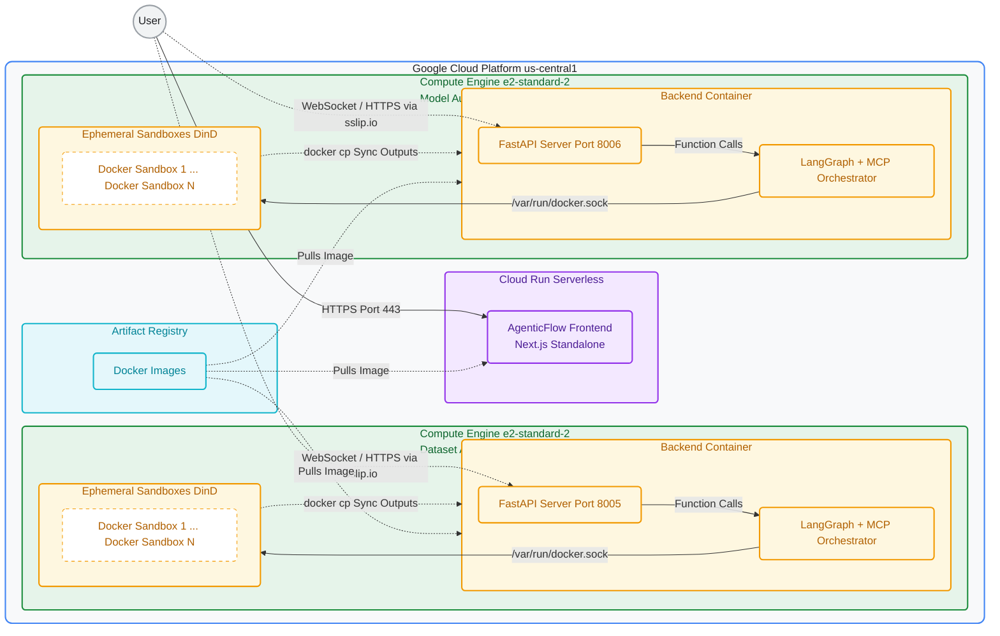

# Aletheia AI - Deployment Architecture

This document outlines the dual-VM production deployment architecture for Aletheia AI. We split the backend workloads across two separate Virtual Machines to prevent out-of-memory crashes during heavy LangGraph executions, and host the frontend on serverless infrastructure.

## Infrastructure Overview

### Components:
1. **Frontend (Google Cloud Run):** A serverless Next.js container deployed in `us-central1` that securely routes the user's interface.
2. **Dataset Auditor VM (`aletheia-dataset-vm`):** A dedicated Compute Engine instance with a reserved static IP, exposing port `8005`. It handles dataset parsing, auditing, and proxy mitigation via its internal Docker Sandbox.
3. **Model Auditor VM (`aletheia-model-vm`):** A dedicated Compute Engine instance with a reserved static IP, exposing port `8006`. It executes heavy predictive models, generates SHAP values, and runs counterfactual fairness tests.
